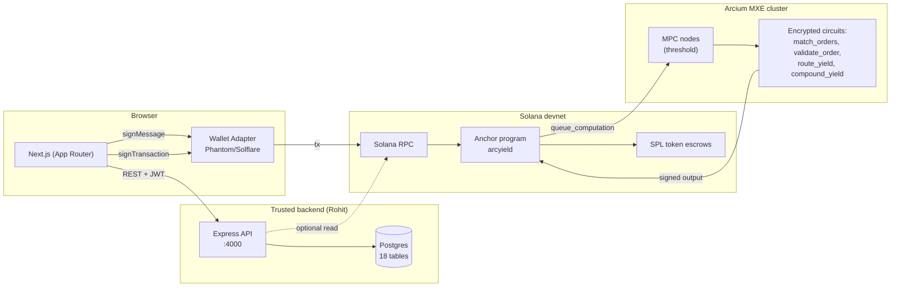
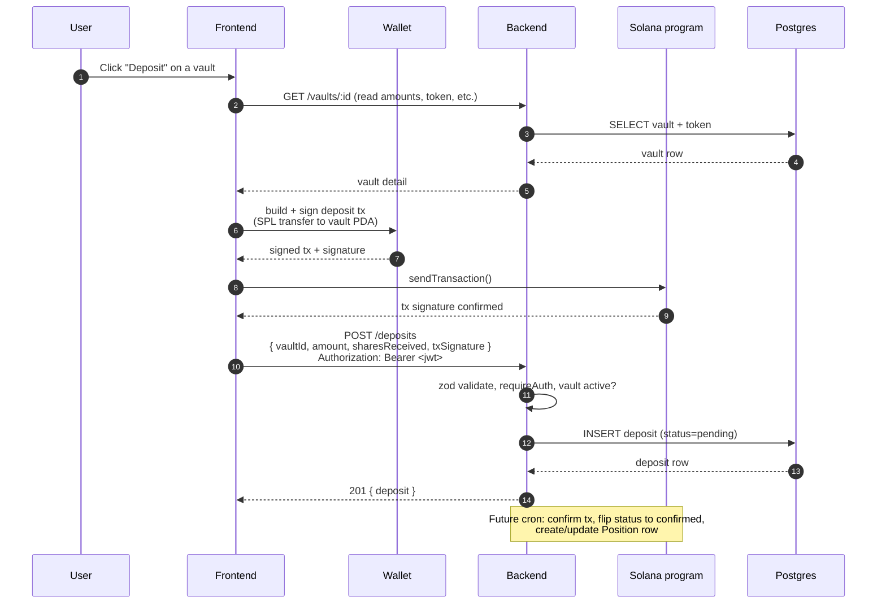
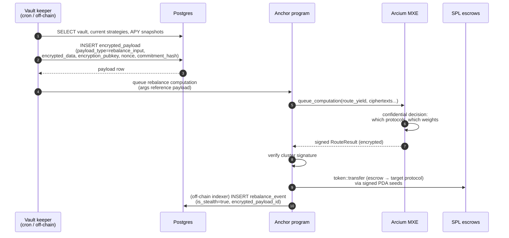

# YieldVeil — High Level Design

System architecture, trust boundaries, and the two flows that actually matter for the demo: deposit and rebalance.

Owner: Rohit. Last updated: 2026-05-07.

For API contracts and DB schema, see [LLD.md](./LLD.md).

---

## 1. Goals

- **Privacy-preserving DeFi yield aggregator on Solana.** User deposits a token, the protocol routes capital across underlying venues (Raydium, Orca, Drift), and execution decisions stay hidden from MEV bots / copy traders.
- **Confidential execution via Arcium MXE.** Order matching and rebalance routing happen inside an MPC cluster, not on-chain plaintext.
- **Standard DeFi UX.** Wallet sign-in (no passwords), single-click deposit, dashboard of positions.

### Non-goals (for the 21-day window)

- Real liquidity / mainnet deploy. Everything targets devnet.
- A relayer network. The demo uses one relayer wallet.
- Production-grade audit. The on-chain ed25519 verify is currently a placeholder.

---

## 2. System diagram

---

## 3. Components

| Component | Owner | Responsibility | Tech |
|---|---|---|---|
| Frontend | Aditya (UI/wallet) + Rohit (API wiring) | Render vaults / dashboard / positions, drive wallet sign-in, sign deposit/withdraw txs | Next.js 14, Solana Wallet Adapter |
| Backend API | Rohit | Auth (SIWS → JWT), read models for vaults / positions / dashboard, record tx signatures | Express + TS, Prisma 7 with `@prisma/adapter-pg` |
| Postgres | Rohit | Source of truth for users, vault metadata, positions, encrypted payload cache, audit logs | Postgres 16 in Docker (dev) |
| Anchor program | Aditya | On-chain orderbook, escrow custody, yield position lifecycle, Arcium computation queue + callback | Rust / Anchor / `arcium-anchor` |
| Arcium MXE | Aditya | Confidential order matching, validation, yield routing, compounding | Arcis-encrypted Rust circuits |
| Wallet | User | Hold keys, sign messages and transactions | Phantom, Solflare |

---

## 4. Trust boundaries

| Boundary | What's trusted across it | What's not |
|---|---|---|
| Browser ↔ Backend | Browser presents a JWT proving wallet ownership (via SIWS) | Backend must NOT trust client-claimed `walletAddress` for protected reads/writes; always derive from JWT `sub` |
| Backend ↔ Postgres | Same trust domain (single deploy unit) | DB credentials live in `.env`, never committed |
| Browser ↔ Solana | Wallet keys never leave the browser | Backend never holds the user's keys — it cannot sign deposits |
| Solana program ↔ Arcium | Cluster signs results with the MXE verification key, contract verifies signature | Currently `verify_ed25519` is a **no-op placeholder** ([lib.rs:905-931](../onchain_arcium_struct/programs/onchain_arcium_struct/src/lib.rs#L905-L931)) — must be fixed before devnet deploy or any attacker can forge settlements |
| Backend ↔ Solana RPC | Backend reads on-chain state (optional) | Backend does not co-sign user txs |

**Identity rule**: a user's identity is `walletAddress`. The backend's `User.id` is just a relational handle. JWT carries both; protected endpoints filter by `req.user.sub`, never by client-supplied wallet.

---

## 5. Data flow — deposit

The user's wallet is the only signer of the on-chain transfer. Backend records the tx signature for tracking only.

**What's NOT shown (out of scope for v1):**
- The cron worker that watches Solana for tx confirmation and flips `deposits.status: pending → confirmed`.
- The position-update job that aggregates confirmed deposits into the `positions` row.

For the demo, manually flipping status in Prisma Studio is acceptable.

---

## 6. Data flow — rebalance (stealth via Arcium)

This is the privacy-defining flow. The vault's strategy reweighting is decided inside Arcium — observers see only an opaque computation queue.

**Why this preserves privacy:** the rebalance *amounts* and *target protocol weights* live inside the encrypted MPC computation. On-chain observers see "vault X queued a computation" and "vault X moved Y tokens between two of its escrows" but cannot infer the strategy logic.

**Risk gate for this flow:**
- The `verify_ed25519` placeholder. Until replaced, an attacker can submit a fake `RouteResult` and drain escrows. Hard blocker for any non-private-devnet deploy.

---

## 7. Cross-team interfaces

The two seams that need explicit agreement:

| Seam | Owners | Status |
|---|---|---|
| Frontend ↔ Backend REST | Rohit + Aditya | ✅ Pinned. See [LLD §2-3](./LLD.md#2-api-surface). Aditya stores JWT in `localStorage.auth_token`; backend validates `Bearer <token>`. |
| Frontend ↔ Solana program | Aditya | ⚠️ Pending. `lib/anchor.ts` not built yet; will wrap `place_order`, `open_yield_position`, deposit/withdraw. |
| Backend ↔ Solana RPC | Rohit (read-only later) | ⚠️ Optional v1. Tx confirmation cron is post-MVP. |
| Backend ↔ Arcium payload format | Rohit + Aditya | ❌ **Not pinned.** Tracked in [LLD §6](./LLD.md#6-encrypted-payload-format). 30-min sync needed before vault-side encrypted writes are real. |

---

## 8. Risks (state at 2026-05-07)

| Risk | Severity | Owner | Mitigation |
|---|---|---|---|
| `verify_ed25519` is a no-op placeholder | **Critical** — invalidates the settlement signature check | Aditya | Swap in `ed25519-dalek` or Solana's `Ed25519SigVerify` precompile before devnet deploy |
| Encrypted-payload format not pinned | High — every `EncryptedPayload` write is shape-uncertain | Both | 30-min sync, capture in [LLD §6](./LLD.md#6-encrypted-payload-format) |
| Devnet deploy not yet attempted | High — Day-11 critical-path gate | Aditya | Day 9-11 priority |
| Nonce store is in-memory | Low for v1 — works for single-process demo | Rohit | Move to Redis or DB table post-MVP |
| Tx confirmation cron not built | Medium — `deposits.status` stays `pending` | Rohit | Manually flip in dev; build worker post-demo |
| Wallet adapter has empty `wallets={[]}` | Medium — modal won't show options | Aditya | Pass `[new PhantomWalletAdapter(), new SolflareWalletAdapter()]` |

---

## 9. Deployment shape (demo)

For the Day-12 demo:
- Frontend: `next dev` on `localhost:3000` (or Vercel preview if it lands)
- Backend: `npm run dev` on `localhost:4000`
- Postgres: docker compose, single container
- Solana: devnet
- Arcium: devnet cluster (whichever Aditya targets)

A real deploy (Vercel + Railway/Fly + Neon) is a Day-15+ stretch and not on the critical path.
