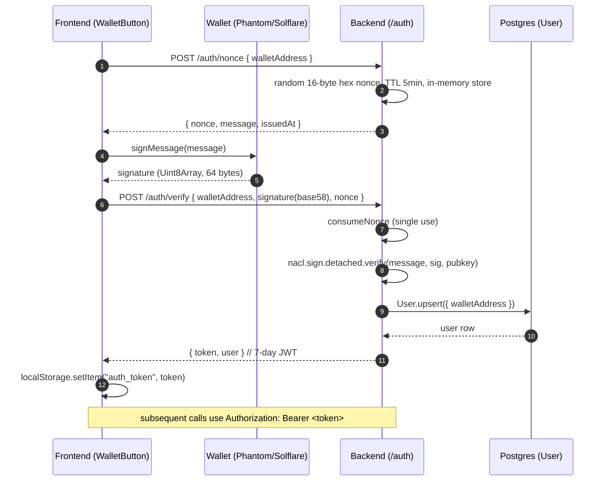
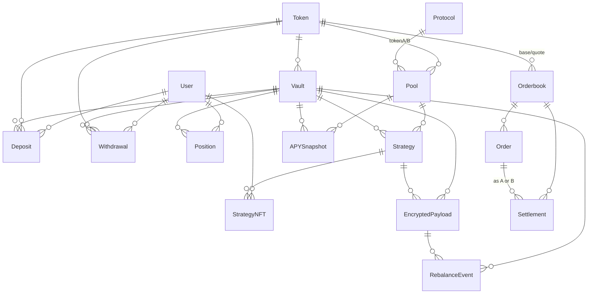

# YieldVeil — Low Level Design

Backend + DB design for the Web2 layer that sits between the Next.js frontend and the on-chain / Arcium components.

Owner: Rohit. Last updated: 2026-05-07.

---

## 1. Scope

This document covers everything between the browser and the Solana program:

- REST API (Express, port 4000)
- Auth flow (Sign-In With Solana → JWT)
- Postgres schema (18 entities, Prisma)
- Encrypted-payload contract with the on-chain program (open with Aditya)

It does **not** cover Anchor instructions, Arcium MPC circuits, or the wallet adapter. See [HLD.md](./HLD.md) for system context, and the on-chain program at [onchain_arcium_struct/programs/onchain_arcium_struct/src/lib.rs](../onchain_arcium_struct/programs/onchain_arcium_struct/src/lib.rs) for the contract surface.

---

## 2. API surface

Base URL (dev): `http://localhost:4000`. Configurable via `NEXT_PUBLIC_SERVER_URL` on the frontend.

| Method | Path | Auth | Purpose |
|---|---|---|---|
| GET  | `/health` | — | DB + service liveness |
| POST | `/auth/nonce` | — | Issue 5-min single-use challenge for a wallet |
| POST | `/auth/verify` | — | Verify ed25519 sig of challenge, mint JWT |
| GET  | `/auth/me` | Bearer | Current user from JWT |
| GET  | `/vaults` | — | Active vault list with token + counts |
| GET  | `/vaults/:id` | — | Vault detail with strategies → pools → protocol |
| GET  | `/strategies/:vaultId` | — | Active strategies for a vault |
| GET  | `/positions` | Bearer | Caller's active positions |
| GET  | `/dashboard/summary` | Bearer | Aggregated deposit / current value / PnL |
| POST | `/deposits` | Bearer | Record a deposit (after on-chain tx confirms) |
| POST | `/withdrawals` | Bearer | Record a withdrawal (after on-chain tx confirms) |

All responses are JSON with `content-type: application/json`.

---

## 3. Request / response schemas

### 3.1 Auth

**`POST /auth/nonce`**

```json
// request
{ "walletAddress": "<base58, 32-44 chars>" }

// 200
{
  "nonce": "<32 hex chars>",
  "issuedAt": "2026-05-07T10:00:00.000Z",
  "message": "YieldVeil sign-in\n\nNonce: <nonce>\nIssued at: <iso>"
}
```

**`POST /auth/verify`**

```json
// request
{
  "walletAddress": "<base58>",
  "signature":     "<base58, 64 bytes>",
  "nonce":         "<32 hex chars>"
}

// 200
{
  "token": "<jwt>",
  "user":  { "id": "<uuid>", "walletAddress": "<base58>", "displayName": null }
}

// 401
{ "error": "invalid_or_expired_nonce" | "invalid_signature" }
```

JWT claims:
```ts
{ sub: <userId uuid>, walletAddress: <base58>, iat, exp }   // 7-day TTL by default
```

The frontend stores the JWT in `localStorage.auth_token` and sends `Authorization: Bearer <token>` on every protected request.

### 3.2 Vaults / strategies

**`GET /vaults`** — public.

```json
{
  "vaults": [
    {
      "id": "<uuid>",
      "vaultAddress": "<base58>",
      "name": "SOL-USDC Yield",
      "tvl": "1200000",            // Decimal as string
      "currentApy": "24.5",
      "totalShares": "1180000",
      "status": "active",
      "token": { "symbol": "USDC", "name": "USD Coin", "decimals": 6, "logoUrl": "..." },
      "_count": { "strategies": 2, "positions": 0 }
    }
  ]
}
```

**`GET /vaults/:id`** — same shape, but `_count` replaced by full `strategies[]` with nested `pool` → `protocol`/`tokenA`/`tokenB`. 404 on unknown id.

**`GET /strategies/:vaultId`** — array of active strategies for a vault.

### 3.3 Positions / dashboard (auth required)

**`GET /positions`**

```json
{
  "positions": [
    {
      "id": "<uuid>",
      "shares": "1000",
      "depositValue": "1000",
      "currentValue": "1024.5",
      "unrealizedPnl": "24.5",
      "status": "active",
      "openedAt": "2026-05-07T10:00:00.000Z",
      "vault": { "id": "...", "name": "SOL-USDC Yield", "currentApy": "24.5",
                 "token": { "symbol": "USDC", "decimals": 6, "logoUrl": "..." } }
    }
  ]
}
```

**`GET /dashboard/summary`**

```json
{
  "totalDeposited": "1000",
  "totalCurrentValue": "1024.5",
  "totalUnrealizedPnl": "24.5",
  "activePositions": 1
}
```

### 3.4 Deposits / withdrawals (auth required)

The on-chain transfer is signed by the user's wallet on the client. The backend only records the resulting tx signature; it does not co-sign.

**`POST /deposits`**

```json
// request
{
  "vaultId":       "<uuid>",
  "amount":        "1000",         // decimal string, base units of vault.tokenId
  "sharesReceived":"1000",         // decimal string
  "txSignature":   "<solana tx signature, 64–128 chars>"
}

// 201
{ "deposit": { "id": "<uuid>", ..., "status": "pending" } }

// 400 on schema fail, 404 vault not found, 409 vault not active
```

**`POST /withdrawals`** — same shape, with `sharesBurned` instead of `sharesReceived`.

A future job (cron, not yet implemented) confirms the tx and flips status `pending → confirmed | failed`.

### 3.5 Error model

Every error response is `{ "error": "<machine_code>", "details"?: <zod flatten> }`.

| Code | Meaning |
|---|---|
| `bad_request` | Zod validation failure (`details` present) |
| `missing_token` / `invalid_token` | Bearer auth required |
| `invalid_or_expired_nonce` | Replay or expired challenge |
| `invalid_signature` | ed25519 verify failed |
| `vault_not_found` | 404 |
| `vault_not_active` | 409, vault is paused/deprecated |
| `internal_error` | 500, unhandled (shouldn't happen — `asyncHandler` catches all) |

---

## 4. Auth flow



**Why nonce store is in-memory.** Single-process dev / demo only. Replace with Redis or a `nonces` DB table before any horizontal scale.

**Why JWT, not session cookies.** Stateless — no server affinity needed, plays nicely with the planned demo deployment.

---

## 5. Database

Postgres 16 via Docker for dev. Prisma 7 with the `@prisma/adapter-pg` driver adapter (Prisma 7 requires an adapter; bare `new PrismaClient()` no longer works).

Schema lives at [prisma/schema.prisma](../prisma/schema.prisma). Migrations in [prisma/migrations/](../prisma/migrations/).

### 5.1 Entity overview (18 tables)



### 5.2 Key tables

| Table | Primary purpose | Key fields |
|---|---|---|
| `users` | Wallet identity | `wallet_address` unique |
| `tokens` | SPL token metadata | `mint_address` unique, `decimals` |
| `protocols` | Raydium / Orca / Drift / etc. | `contract_address` |
| `pools` | Underlying LP / orderbook venues | `pool_address` unique, `tvl`, `current_apy` |
| `vaults` | YieldVeil vaults | `vault_address` unique, `tvl`, `current_apy`, `total_shares`, `status` |
| `strategies` | Allocation rules per vault | `vault_id`, `risk_level`, `allocation_weight`, `is_encrypted` |
| `encrypted_payloads` | Off-chain Arcium payload cache | `encrypted_data` (Bytes), `encryption_pubkey`, `nonce`, `commitment_hash`, `status` |
| `orderbooks` | On-chain encrypted orderbooks | `arcium_artifact_id`, `arcium_verification_key`, `arcium_mxe_public_key` |
| `orders` | Encrypted orders | ciphertexts for `order` / `price` / `size` / `is_buy`, `escrow_amount` |
| `settlements` | Cleared matched pairs | `settlement_hash` unique (replay prevention), `arcium_signature` |
| `deposits` / `withdrawals` | User flow records | `tx_signature`, `status` |
| `positions` | Per-user vault stake | unique `(user_id, vault_id)`, `shares`, `unrealized_pnl` |
| `rebalance_events` | Vault strategy reweights | `is_stealth`, optional `encrypted_payload_id` |
| `strategy_nfts` | cNFT tracking historical positions | `cnft_mint_address` unique |
| `apy_snapshots` | Time-series APY for vaults / pools | `apy_value`, `recorded_at` |
| `cron_jobs` / `integration_logs` | Operational | scan / rebalance / compound jobs and step logs |

### 5.3 Indexes worth noting

- `orders(orderbook_id, status)` — settlement engine scans pending orders.
- `deposits(user_id, status)`, `withdrawals(user_id, status)` — user history.
- `apy_snapshots(vault_id, recorded_at)` — chart queries.
- `integration_logs(step_name, status, created_at)` — operational debugging.

---

## 6. Encrypted-payload format

This is the primary cross-team contract with Aditya. As of 2026-05-07 the `encrypted_payloads` row contains:

| Column | Type | Notes |
|---|---|---|
| `encrypted_data` | `Bytes` | Raw ciphertext payload |
| `encryption_pubkey` | `String` | 32-byte hex of the x25519 pubkey used by Arcium |
| `nonce` | `BigInt` | u128 nonce passed to `queue_computation` |
| `commitment_hash` | `String` | 32-byte hex commitment |
| `payload_type` | enum | `rebalance_input` / `order_data` / `strategy_params` |

**Open with Aditya** (must be pinned before any vault `EncryptedPayload` write path matters):

1. Exact encoding of `encrypted_data` per `payload_type`. The on-chain side uses fixed shapes (`[u8; 96]` for an order ciphertext, `[u8; 32]` for individual encrypted u8/u64 fields). The DB side is variable-length `Bytes` — we need a versioned envelope or per-type fixed lengths documented here.
2. Whether `commitment_hash` is keccak256 / sha256 / blake3, and what bytes it's computed over.
3. Server-side validation we can do before persisting (length checks, hash check against `encrypted_data`).

Until that sync happens, the API accepts whatever the client sends and the integrity checks are advisory only.

---

## 7. Local dev setup

```bash
# 1. Postgres (one-shot)
docker compose up -d

# 2. Migrate
cd server && DATABASE_URL=... npm run db:migrate

# 3. Seed
npm run db:seed   # idempotent

# 4. Run backend (port 4000)
npm run dev

# 5. Run frontend (port 3000)
cd .. && npm run dev
```

Required env vars (see [server/.env.example](../server/.env.example)):
- `DATABASE_URL`
- `JWT_SECRET` (long random string)
- `CORS_ORIGIN` (default `http://localhost:3000`)
- Frontend: `NEXT_PUBLIC_SERVER_URL` (default `http://localhost:4000`)
